# 用户手册

## 项目简介

3D 第一人称视角游戏，旨在让玩家合作共同打开之间隔阂的门，相对于其他对战类游戏更具有现实意义。

项目已经部署到云端，欢迎访问 [Find Me Connect Us](http://aki2.eastasia.cloudapp.azure.com/fmcu/) 进行游戏。

## 登录注册

登录界面预览：

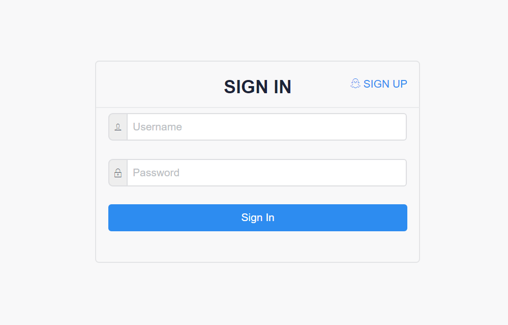

这是一个简单的登录界面，输入用户名和密码就能登录到用户界面。点击右上角 SIGN UP 标志就可以跳转到注册页面。

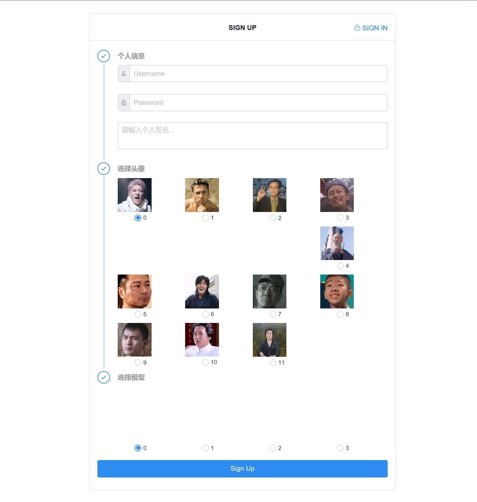

填写必要的个人信息，选择头像（具有彩蛋音），选择模型，点击按钮即可注册。

## 用户界面

用户界面预览：

右上角显示选择的头像，material design 的设计，左边栏有很多栏目，在其他功能中会详细介绍。

点击 Game Now! 按钮进入房间创建选择界面。

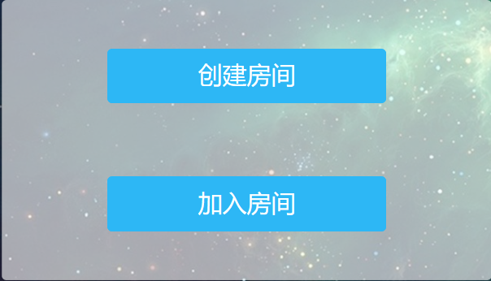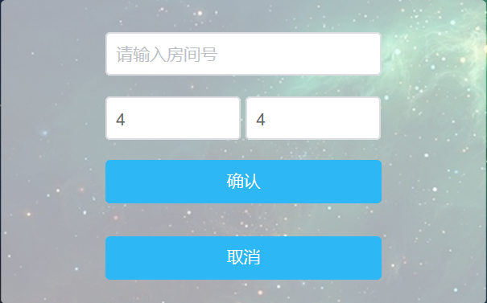

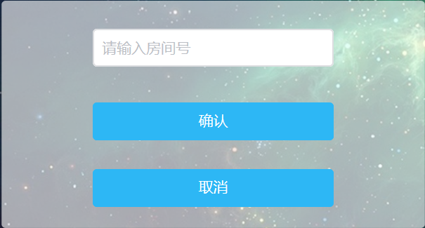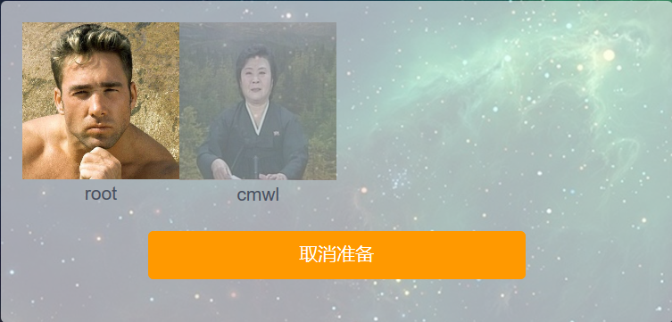

左上是选择创建房间还是加入房间；右上是创建房间，可选择房间大小；左下输入房间号即可加入别人的房间；右下准备界面，未准备的玩家头像会显示灰色，所有玩家准备即可开始游戏。

## 游戏界面

### 游戏规则

#### 游戏流程

* **线索**
  * 玩家会收到一个线索卡，这张线索卡暗示了一件当前所有玩家可到达房间内的某一件物件。
* **选择**
  * 所有玩家收到线索信息之后，需要在时限内找出这个物品。点击某个物品，即可以将物品提交，在时限内，玩家必须对当前所有已展示物品投票。
* **判定**
  * 玩家投票出了正确物品，会获得一把钥匙，这把钥匙能够任意一扇门。
  * 玩家投票物品错误或未投票，必须选择剔除某个玩家并随机关闭一间无人的房间，与该房间的连通全部中断，必须再次用钥匙打开。

#### 游戏条件

* **初始**
  * 3~8 名玩家随机出生在不同的封闭房间场景。每一个房间里有一些物品和通向相邻房间的门，门一开始不可打开。
* **胜利**
  * 当所有的玩家能够互相到达，游戏胜利。
* **失败**
  * 当前玩家的数量少于游戏开始时总人数的一半，游戏失败。

### 游戏操作

* `wasd` 控制移动，鼠标控制方向
* 点击右下角眼睛，查看线索
* 点击钥匙选中门即可开门
* 剩下的按钮可以播放注册时的彩蛋音效

### 游戏截图

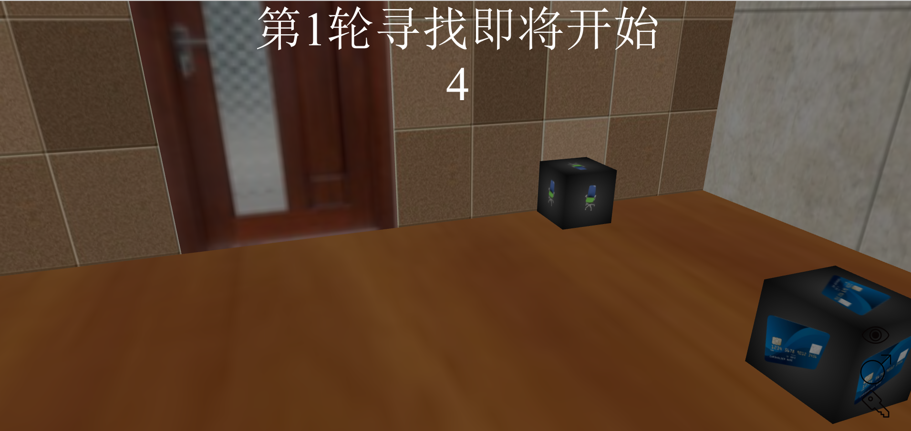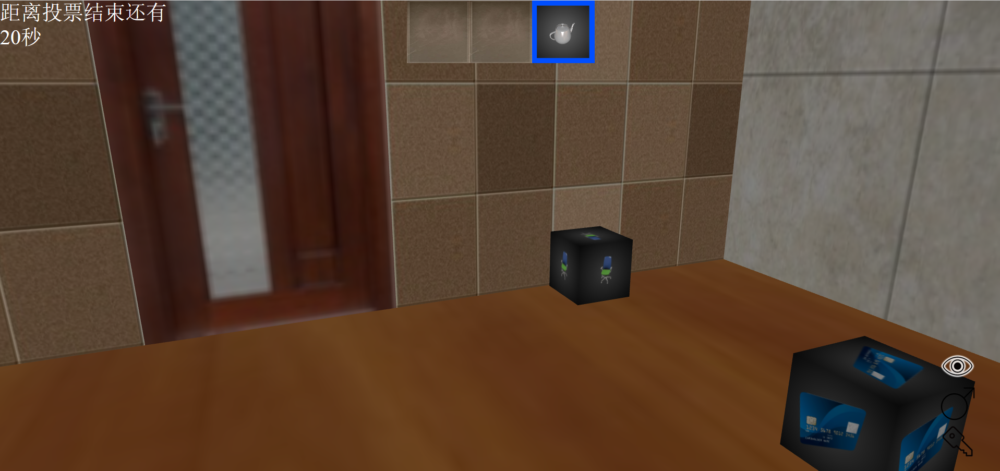

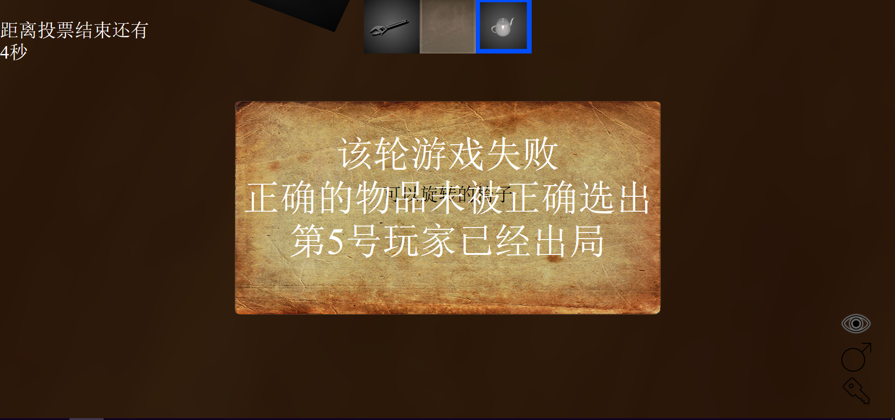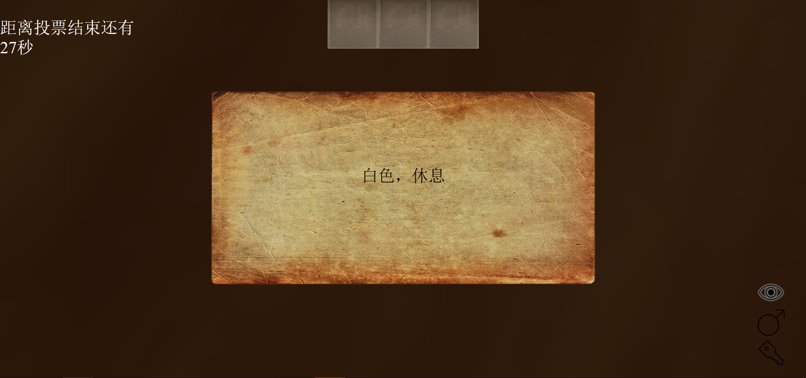

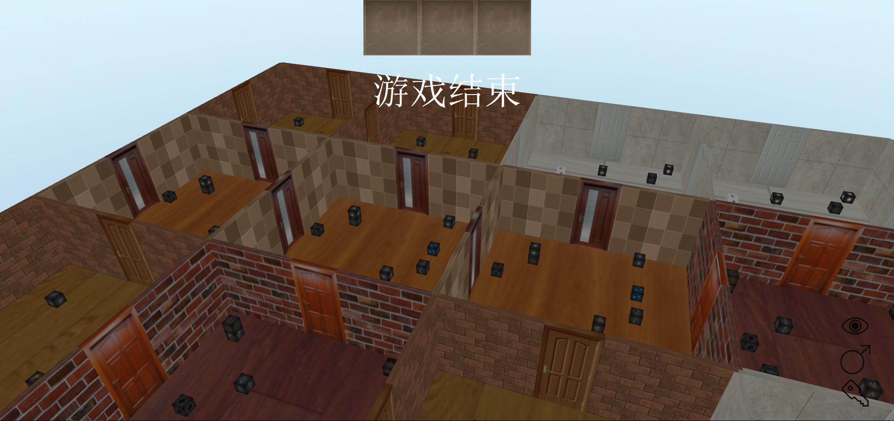

## 其他功能

### Role

模型浏览

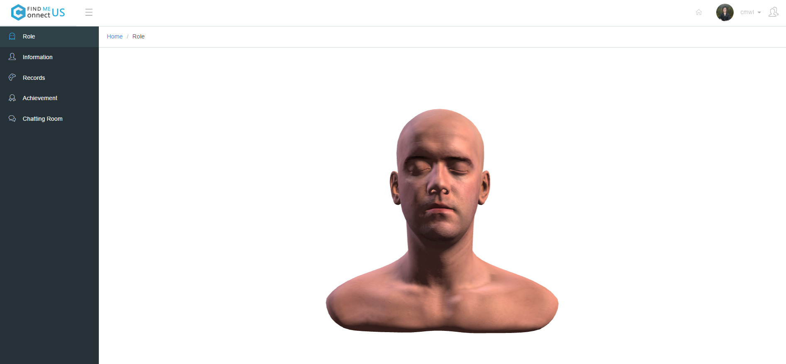

### Information

信息界面，点击右上角按钮可进行修改

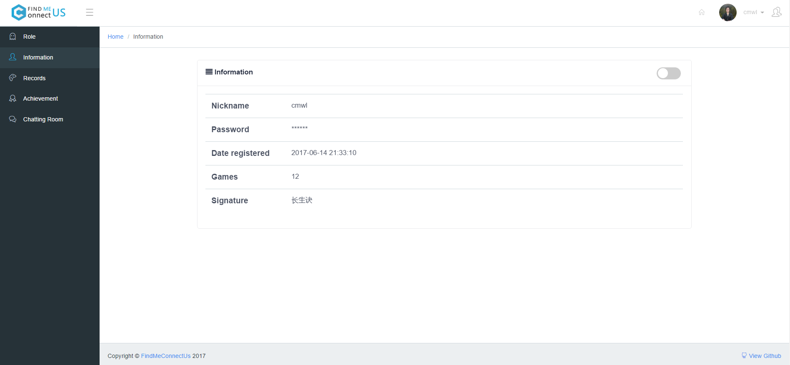

### Records

游戏记录

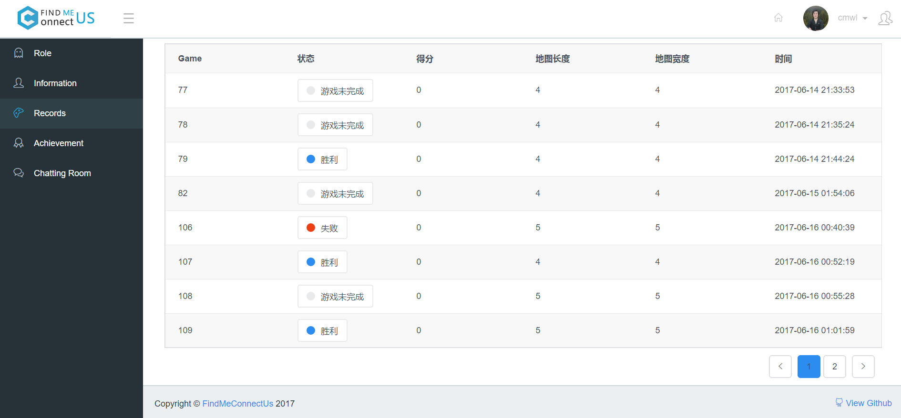

### Chatting room

聊天室

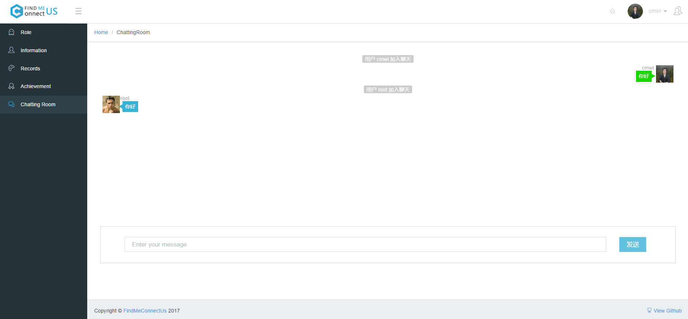

